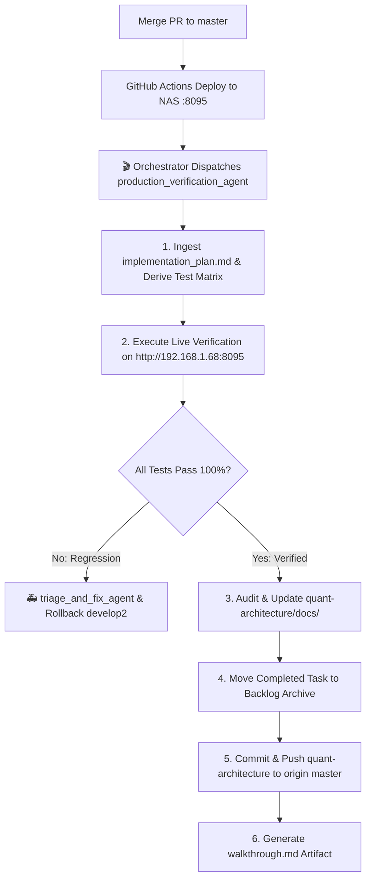

# 🎯 Subagent Spec: Production Verification & Doc Sync Agent (`production_verification_agent`)

> **Role:** Production Verification & Architecture Documentation Sync Agent  
> **Type Name:** `production_verification_agent`  
> **Activation Trigger:** Phase 7 (Post-Merge to `master` & Production Deploy on Synology NAS port `8095`).  
> **Mandate:** Derive live verification tests from `implementation_plan.md` and architecture blueprints, verify production hardware on port `8095`, update master architecture docs in `quant-architecture/docs/`, and archive completed backlog milestones.

---

## 1. Operating Lifecycle & State Machine Role

---

## 2. Invariant Rules for `production_verification_agent`

1. **Derived Test Matrix:**
   The agent MUST derive test cases directly from `implementation_plan.md` (Authentication, Data Integrity, Endpoints, Latency, SSE Streaming, Fault Isolation).
2. **Real Hardware Verification:**
   Tests MUST run against the live Synology NAS Production deployment (`http://192.168.1.68:8095`). Mocking is strictly prohibited in this phase.
3. **Mandatory Documentation Sync:**
   The agent is the sole executor responsible for synchronizing `quant-architecture/docs/` (`ARCHITECTURE_OVERVIEW.md`, `APIS_AND_GATEWAYS.md`, `DATABASE_AND_DATA_MODELS.md`) and archiving `00_ACTIVE_BACKLOG.md`.
4. **Git Promotion Integrity:**
   Commits to `quant-architecture` master are executed only after live production verification passes 100%.
