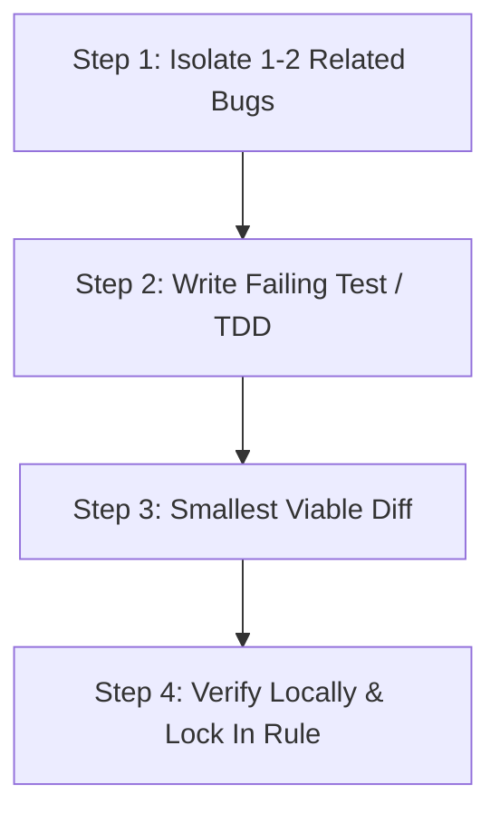

# 🛡️ Bug Triage & Remediation Protocol (L8 Standard)

When resolving bugs, errors, or code review findings across the Quant System, all agents MUST follow this 4-step procedure:

---

## 1. Triage by Blast Radius (Fix Hierarchy)
Never attempt to resolve all findings in a single unstructured pass. Triage and sequence fixes according to this severity hierarchy:

1. **Tier 1: 🔴 Critical Blockers (Immediate Priority)**
   - Silent data loss (e.g. scraper cutoff drops).
   - Database race conditions & table locking (e.g. static temp table collisions).
   - Destructive test side effects (e.g. tests mutating production DB tables).
   - Plaintext credentials or session leaks in source code.

2. **Tier 2: 🟠 High-Impact Correctness**
   - Mathematical / Greek calculation bugs (e.g. DTE operator precedence).
   - Socket & connection leaks (e.g. missing `finally: ib.disconnect()`).
   - Regex boundaries & format truncation (e.g. 4-digit constraints).
   - Unauthenticated API routes or timing attacks.

3. **Tier 3: 🟡 Reliability & UI Glitches**
   - DOM ID mismatches and chart lightbox failures.
   - Message length overflow (e.g. Discord 2000-character limits).
   - Missing repository stubs and incomplete pipeline skeletons.

4. **Tier 4: 🟢 Polish & Accessibility**
   - ARIA labels, comment hygiene, and typing aesthetics.

---

## 2. The 4-Step Remediation Loop



### Step 1: Micro-Plan Scope & Backlog Ingestion
- **Zero-Lost Bugs Invariant (MANDATORY):** Any bug, edge case, or defect discovered during development, testing, or review that is NOT immediately patched in the active turn MUST be logged immediately into `implementation_plans/00_ACTIVE_BACKLOG.md` with priority, component, and blast radius.
- Scope each active remediation task to **1 to 3 closely related bugs** within a single subsystem or dependency boundary.

### Step 2: Test-First Reproduction (TDD)
- The Captain dispatches the appropriate crew subagent (`backend_agent`, `frontend_agent`, or `pipeline_agent`).
- The subagent writes an isolated regression test in `tests/` that reproduces the bug (RED).

### Step 3: Smallest Viable Diff (Strict YAGNI)
- The subagent patches ONLY the lines necessary to fix the root cause with zero collateral churn.

### Step 4: Multi-Agent Staging Dual-Gate Verification, Review & Lock-In
- The subagent runs local `pytest` to verify the fix (GREEN).
- The Captain dispatches the `no-mistakes-reviewer` subagent for pre-merge adversarial review (Phase 5a).
- For architectural changes, dispatch `architecture_review_agent` (Phase 5b).
- Deploy to `develop2` staging (`8096`).
- **Mandatory Dual Staging Validation Gates (Synology NAS :8096):**
  1. Dispatch `vertical_test_agent` against the live staging container (`:8096`) to verify the 6-layer pipeline and SSE stream.
  2. Dispatch `staging_devtools_agent` via Chrome DevTools MCP against `http://192.168.1.68:8096` to execute real-browser UI regression tests, audit console logs, verify non-zero DOM/Canvas geometry, and capture visual screenshot proof.
- Upon 100% green staging verification, promote/merge PR to `master` (Production `:8095`), move the task from `00_ACTIVE_BACKLOG.md` to `completed_archive/`, and synchronize living documentation in `docs/`.

---

## 3. Staging Defect Intercept Pattern (In-Situ Branching)

When testing an active feature workflow on **Staging (`:8096`)** or at the **Production Gate**, any defect or unexpected behavior discovered in-situ MUST be intercepted via a nested remediation loop:

1. **Spawn Nested Defect**:
   ```bash
   python scripts/protocol_graph.py staging-bug --name "<defect-description>"
   ```
   * The parent feature workflow is immediately suspended at its current node.
   * Production promotion (`prod-authorize`) is strictly locked and prohibited.
2. **Execute Mandatory RED $\rightarrow$ GREEN Remediation**:
   * Write reproduction test (`tests/test_reproduce_<issue>.js` or `.py`).
   * Verify failure: `python scripts/protocol_graph.py red --test <path>`.
   * Apply smallest viable diff.
   * Verify pass: `python scripts/protocol_graph.py green`.
   * Run adversarial audit: `python scripts/protocol_graph.py audit`.
3. **Re-deploy & Verify on Staging**:
   * Deploy fix to `develop2` staging (`:8096`).
   * Run: `python scripts/protocol_graph.py staging-verify`.
   * The defect workflow is marked resolved, popped from the stack, and the parent feature workflow is cleanly resumed at `PHASE_5_STAGING` for final acceptance.
