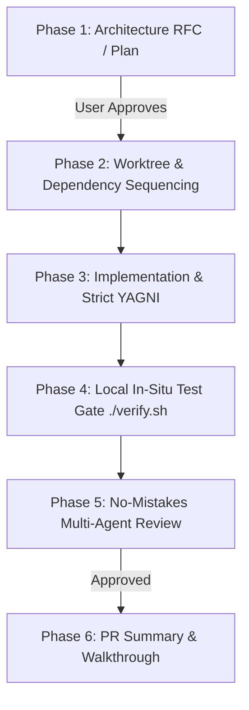
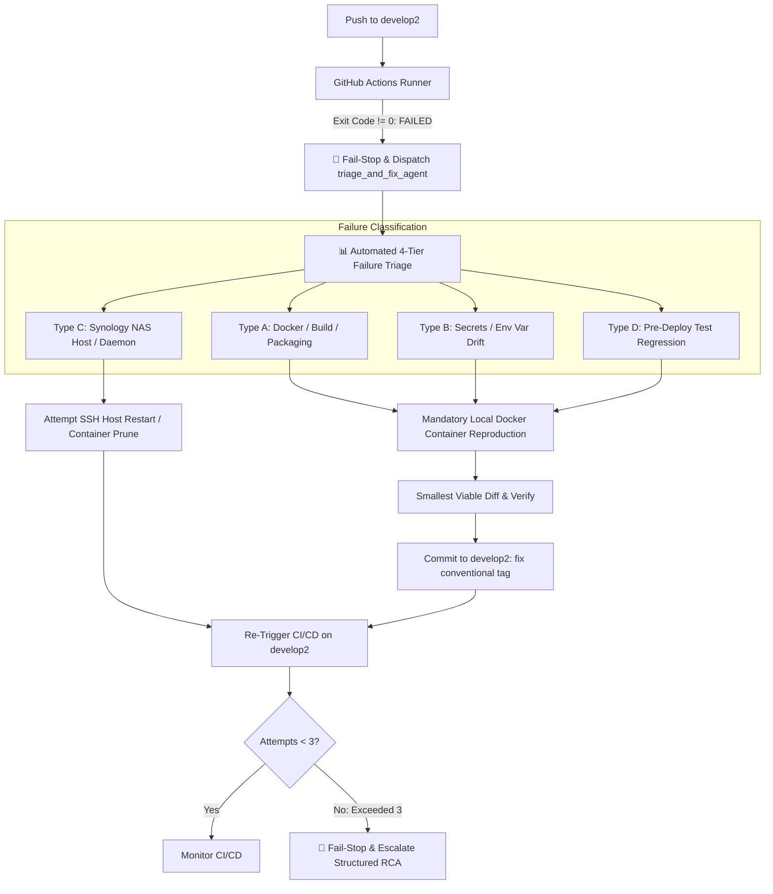

# 🚀 Feature Development Protocol (L8 Standard)

When developing new features, integrations, or capabilities across the Quant System, all agents MUST follow this 6-phase engineering lifecycle:

---

## 1. The 6-Phase Feature Lifecycle

---

## 2. Detailed Phase Specifications

### Phase 1: Orchestrator Ingestion, Architecture RFC & Plan
- **Mandatory Orchestrator Entrypoint:** Every new feature, integration, or refactor MUST begin by activating the `orchestrator` agent. The Orchestrator manages the active backlog (`00_ACTIVE_BACKLOG.md`), creates the implementation plan, coordinates worker subagents, and enforces all testing gates.
- Never write source code from an initial prompt. Always create `implementation_plans/<feature_name>.md`.
- **Mandatory Plan Structure:**
  1. **Architecture & Design Decisions:** Explain technical trade-offs, schemas, and API contracts.
  2. **User Review Required:** Highlight any breaking changes or design choices using GitHub alerts.
  3. **Open Questions:** Surface any ambiguities before proceeding.
  4. **Component Breakdown:** Categorize files logically with `[NEW]`, `[MODIFY]`, or `[DELETE]` annotations.
  5. **Verification Plan:** Define automated test commands (`pytest`, `./verify.sh`) and manual validation steps.
- **Approval Gate:** STOP and wait for the human Engineering Director's explicit approval before proceeding.

### Phase 2: Dependency Sequencing & Worktree Isolation
- Always sequence cross-repo development in correct architectural order:
  1. `common-lib` / `common_config` (Shared models & connectors)
  2. `gexdex-api` / `gateway` (Endpoints & calculations)
  3. `*-pipeline` (ETL scrapers & database loaders)
  4. `quant-pwa` / `discord-quant-bot` (Clients & UI)
- Isolate execution to the active feature branch on `develop2` (or dedicated worktree).

### Phase 3: Orchestrator Crew Dispatch & Parallel Implementation (Strict YAGNI)
- **Automatic Subagent Delegation:** As soon as Phase 1 is approved, the `orchestrator` MUST automatically dispatch specialized worker Subagents (`backend_agent`, `frontend_agent`, `pipeline_agent`) concurrently.
- **Supervision & Termination:** The `orchestrator` monitors running agents, sends corrective guidance, and can stop/kill agents (`manage_subagents`) if regressions or architectural violations occur.
- **Smallest Viable Diff:** Implement ONLY the capabilities approved in Phase 1.
- **Strict Typing:** All data models must use Pydantic models (Python) or explicit interfaces (TypeScript).
- **Configuration Hygiene:** Read all parameters from `MainConfig` or environment variables; never hardcode credentials, ports, or URLs.
- **Failure Resilience:** Wrap network operations in exponential backoff retries and explicit timeouts.

### Phase 4: Local In-Situ Verification & Vertical Testing Gate
- Write comprehensive unit tests in `tests/` covering both happy paths and negative edge cases.
- Execute local `./verify.sh` or `pytest` in the workspace to confirm unit tests pass with `exit code 0` in <5 seconds.
- **Mandatory Vertical Testing Agent Gate (`vertical_test_agent`):** In addition to unit tests, the `orchestrator` MUST dispatch `vertical_test_agent` to exercise the full 6-layer in-situ vertical slice (Extract ➔ Transform ➔ Postgres Upsert & Idempotency ➔ Connector Read ➔ Gateway Tool ➔ SSE Stream). Any integration break halts progress and triggers `triage_and_fix_agent` before Phase 5 code reviews.
- **Mandatory Local Docker Container Verification:** For any changes involving dependencies (`requirements.txt`), services, environment variables, or file system volume mounts (`common_config`, `common_lib`), agents MUST build and run the local Docker Compose stack (`docker compose up --build -d`) to verify container mounts, dependencies, and network connections function identically in Docker before pushing to staging.

### Phase 5a: "No-Mistakes" Quality Review Gate
- Run the `no-mistakes-reviewer` subagent on the git diff to audit:
  - 🔒 **Security:** Authentication, CORS, secret management, injection vectors.
  - 🔄 **Concurrency:** Connection pooling, thread safety, graceful teardown.
  - 🧮 **Precision:** Financial calculations, float math, datetime handling.
  - 🧪 **Tests:** Test isolation and coverage.
- If the reviewer returns 🔴 Blockers, the agent must self-heal and re-verify before proceeding.

### Phase 5b: Enterprise Architecture Review Gate (1,000 DAU Baseline)
- Run the `architecture_review_agent` (Enterprise Principal Systems Architect) to evaluate:
  1. **Scalability:** Bottlenecks, stateful traps, and concurrency locks calibrated for 1,000 DAU.
  2. **Maintainability:** Domain decoupling, schema contract stability, and distributed tracing.
  3. **Cost Optimization:** Compute idle capacity, token waste, and egress efficiency.
  4. **Expandability:** Contract stability for adding future microservices and endpoints.
  5. **Anti-Bloat (Zero-Bloat Mandate):** Eliminate redundant hops, resume-driven abstractions, and unnecessary complexity.
- Reviewer outputs the **Enterprise Scorecard**, **Mandatory Engineering Fixes**, and **Target Lean Architecture**.

### Phase 6: Staging Deploy, Hardware Validation & Production Promotion
- **Strict Full Dev Cycle for All Fixes (Rule 1):** Every bug fix, hotfix, and refactor MUST follow the full lifecycle: `Local Test (Host + Docker + vertical_test_agent)` ➔ `develop2 (Staging Deploy & Hardware Live Verification)` ➔ `master (Production Promotion)`. Never fast-track or push fixes directly to `master`.
- **Staging Vertical Test Gate:** Following deployment to Synology NAS staging (`:8096`), `vertical_test_agent` executes against the live staging container to verify the complete vertical slice before opening and merging PRs to `master`.
- **Zero Direct Local Push to Master (Rule 3 - Hard Invariant):** Under NO circumstances is direct local pushing to `master` allowed. `master` can ONLY be updated via merge from `develop`/`develop2` after staging verification.
- **Produce Walkthrough Document:** Detail changes, hardware verification results, and key decisions made.
- **Mandatory Local Server Teardown:** Whenever local testing completes and changes are pushed to `develop`/`develop2` or `master`, agents MUST automatically terminate all local background testing processes (`uvicorn`, `http.server`, Chrome instances) to release local ports (`3000`, `8000`) and conserve PC memory.
- **Mandatory Living Documentation Sync (Production-Only Hard Rule):** The `quant-architecture` repository is **ONLY updated and pushed when code is promoted to Production (`master` / `prod`)**. During staging/develop testing, `quant-architecture` remains frozen. Upon promotion/merging to `master`, agents MUST automatically update all corresponding design and architecture documents in `docs/` (`ARCHITECTURE_OVERVIEW.md`, `DATABASE_AND_DATA_MODELS.md`, `ETL_PIPELINES_AND_INGESTION.md`, `APIS_AND_GATEWAYS.md`, `FRONTEND_AND_BOT_APPLICATIONS.md`, `INFRASTRUCTURE_AND_CICD.md`), update `implementation_plans/00_ACTIVE_BACKLOG.md`, and commit/push `quant-architecture` to `origin master`. Outdated architecture documentation is treated as a critical system defect.

---

## 3. 🚨 CI/CD Staging Failure & Bug Remediation Protocol

When a staging deployment to `develop2` fails during GitHub Actions execution or an integration bug is detected:

### Step 1: Dispatch `triage_and_fix_agent` & Ingest Logs
- When `gh run watch` reports `failure` or `cancelled`:
  - **HARD STOP:** Never attempt to bypass staging or promote to `master`.
  - The Orchestrator automatically dispatches `triage_and_fix_agent` with full log traces from `gh run view <run_id> --log-failed`.

### Step 2: Automated Failure Classification
Classify the error into one of 4 archetypes:
1. **Type A (Docker / Build Failure):** Missing Linux system package, Dockerfile instruction error, wheel build failure in `requirements.txt`.
2. **Type B (Config & Secrets Drift):** Missing environment variable in `.env.template` or GitHub Actions secret mapping.
3. **Type C (Synology NAS Host Collision / Infrastructure):** Port 8096 in use, container name collision, Docker daemon storage exhaustion, or SSH drop.
4. **Type D (Pre-Deploy Test Regression):** Automated test failure executing inside the GitHub Actions runner.

### Step 3: Local Docker Reproduction (Mandatory Gate)
- For Type A, B, and D errors, `triage_and_fix_agent` MUST reproduce and verify the fix locally inside Docker (`docker compose up --build -d`) before pushing. Speculative untested pushes are strictly prohibited.

### Step 4: Infrastructure Self-Healing (SSH Restart)
- For Type C (Host / Infrastructure) errors on the Synology NAS, `triage_and_fix_agent` attempts an SSH restart/cleanup of hanging Docker containers on the NAS host before escalating.

### Step 5: Direct `develop2` Commit & Master Regression Gate
- Commit the fix directly to `develop2` using conventional tags: `fix(cicd): ...`, `fix(gateway): ...`, `fix(docker): ...`.
- **Master Regression Gate (Rule 1):** If a bug occurs while verifying the `master` (Production) branch, the fix MUST STILL go through `develop2`, pass staging verification on port `8096`, and be promoted to `master` via PR. Never patch `master` directly.

### Step 6: 3-Attempt Circuit Breaker
- Up to 3 autonomous fix-and-deploy attempts are permitted per incident. If the 3rd attempt fails on the same root cause, the agent halts immediately and presents a structured RCA report to the human Engineering Director.
