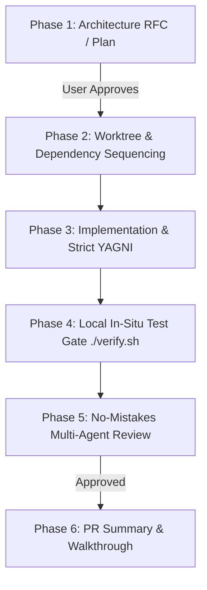

# 🚀 Feature Development Protocol (L8 Standard)

When developing new features, integrations, or capabilities across the Quant System, all agents MUST follow this 6-phase engineering lifecycle:

---

## 1. The 6-Phase Feature Lifecycle

---

## 2. Detailed Phase Specifications

### Phase 1: Architecture RFC & Implementation Plan
- Never write source code from an initial prompt. Always create `implementation_plans/<feature_name>.md`.
- **Mandatory Plan Structure:**
  1. **Architecture & Design Decisions:** Explain technical trade-offs, schemas, and API contracts.
  2. **User Review Required:** Highlight any breaking changes or design choices using GitHub alerts.
  3. **Open Questions:** Surface any ambiguities before proceeding.
  4. **Component Breakdown:** Categorize files logically with `[NEW]`, `[MODIFY]`, or `[DELETE]` annotations.
  5. **Verification Plan:** Define automated test commands (`pytest`, `./verify.sh`) and manual validation steps.
- **Approval Gate:** STOP and wait for the human Engineering Director's explicit approval before proceeding.

### Phase 2: Dependency Sequencing & Worktree Isolation
- Always sequence cross-repo development in correct architectural order:
  1. `common-lib` / `common_config` (Shared models & connectors)
  2. `gexdex-api` / `gateway` (Endpoints & calculations)
  3. `*-pipeline` (ETL scrapers & database loaders)
  4. `quant-pwa` / `discord-quant-bot` (Clients & UI)
- Isolate execution to the active feature branch on `develop2` (or dedicated worktree).

### Phase 3: Implementation & Anti-Bloat (Strict YAGNI)
- **Smallest Viable Diff:** Implement ONLY the capabilities approved in Phase 1.
- **Strict Typing:** All data models must use Pydantic models (Python) or explicit interfaces (TypeScript).
- **Configuration Hygiene:** Read all parameters from `MainConfig` or environment variables; never hardcode credentials, ports, or URLs.
- **Failure Resilience:** Wrap network operations in exponential backoff retries and explicit timeouts.

### Phase 4: Local In-Situ Verification Gate
- Write comprehensive unit tests in `tests/` covering both happy paths and negative edge cases.
- Execute local `./verify.sh` or `pytest` in the workspace to confirm:
  - Static typechecks pass with 0 errors.
  - All unit tests pass with `exit code 0` in <5 seconds.
  - Zero database mutations occur against production tables.

### Phase 5a: "No-Mistakes" Quality Review Gate
- Run the `no-mistakes-reviewer` subagent on the git diff to audit:
  - 🔒 **Security:** Authentication, CORS, secret management, injection vectors.
  - 🔄 **Concurrency:** Connection pooling, thread safety, graceful teardown.
  - 🧮 **Precision:** Financial calculations, float math, datetime handling.
  - 🧪 **Tests:** Test isolation and coverage.
- If the reviewer returns 🔴 Blockers, the agent must self-heal and re-verify before proceeding.

### Phase 5b: Enterprise Architecture Review Gate (1,000 DAU Baseline)
- Run the `architecture_review_agent` (Enterprise Principal Systems Architect) to evaluate:
  1. **Scalability:** Bottlenecks, stateful traps, and concurrency locks calibrated for 1,000 DAU.
  2. **Maintainability:** Domain decoupling, schema contract stability, and distributed tracing.
  3. **Cost Optimization:** Compute idle capacity, token waste, and egress efficiency.
  4. **Expandability:** Contract stability for adding future microservices and endpoints.
  5. **Anti-Bloat (Zero-Bloat Mandate):** Eliminate redundant hops, resume-driven abstractions, and unnecessary complexity.
- Reviewer outputs the **Enterprise Scorecard**, **Mandatory Engineering Fixes**, and **Target Lean Architecture**.

### Phase 6: PR Summary, Staging Validation & Living Documentation
- Produce a clean, concise PR summary document or walkthrough detailing:
  - What was built and why.
  - Verification results and test output.
  - Key decisions made.
- Deploy to staging develop container for human-in-the-loop validation.
- **Mandatory Local Server Teardown:** Whenever local testing completes and changes are pushed to `develop`/`develop2` or `master`, agents MUST automatically terminate all local background testing processes (`uvicorn`, `http.server`, Chrome instances) to release local ports (`3000`, `8000`) and conserve PC memory.
- **Mandatory Living Documentation Sync:** Upon promotion/merging to `master`, automatically update all corresponding design and architecture documents in `docs/` (`ARCHITECTURE_OVERVIEW.md`, `DATABASE_AND_DATA_MODELS.md`, `ETL_PIPELINES_AND_INGESTION.md`, `APIS_AND_GATEWAYS.md`, `FRONTEND_AND_BOT_APPLICATIONS.md`, `INFRASTRUCTURE_AND_CICD.md`). Outdated architecture documentation is treated as a critical system defect.
