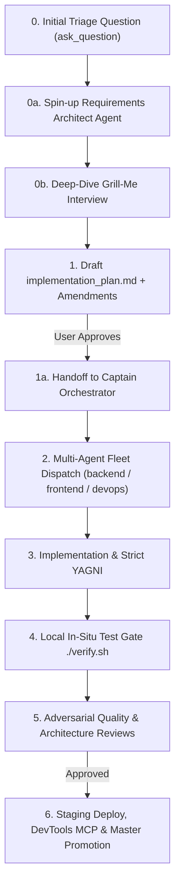

# 🚀 Feature Development Protocol (L8 Standard)

## 0. Mandatory Intake Triage & Dedicated Requirements Architect Gate

Whenever a user requests work, the workflow **MUST START with an interactive triage interview**:

### 1. Mandatory Initial 3-Choice Triage Question (via `ask_question`)
The agent must immediately ask the user:
> **"What are you trying to create?"**
> 1. **A new data model**
> 2. **A new feature to an existing data model**
> 3. **A fix / bug / optimization of an existing data model**

### 2. Dedicated Subagent Spin-Up: `requirements_architect_agent`
A specialized **Requirements & Architecture Intake Agent** (`requirements_architect_agent`) is spun up to conduct the deep-dive Grill-Me interview based on the selected branch:

* **Branch A: New Data Model Workflow:**
  * **Source Schema Question (Exclusive to Branch A):** The agent explicitly asks if source system schemas/folder paths exist.
  * **Folder Path Schema Auto-Scanner:** If a folder path is provided, the agent automatically scans the folder recursively across all file types (`.sql`, `.json`, `.csv`, `.py`, `.ts`, `.prisma`, `.yaml`, `.yml`) to extract all confirmed source tables, columns, and datatypes.
  * **Mockup Mode & AI-Generated Tagging:** If no folder or source schemas are provided, the session is treated as a **Conceptual Mockup**, and every inferred column MUST be tagged as `[AI-GENERATED]`.
  * Grills the user iteratively across domain entities, grain, tracked attributes, temporal requirements (SCD1 / SCD2 / Bi-temporal), and volume.
* **Branch B: New Feature to Existing Data Model:**
  * Asks which existing model to modify (`dim_employee_core_scd2`, `fact_hr_monthly_snapshot`, etc.).
  * **Folder as New Tables Invariant (HARD RULE):** If a folder path is provided in this branch, it is automatically assumed that all schemas/tables found inside that folder are **NEW tables / extension entities to be added and integrated into the existing data model**.
  * Grills the user on new columns, foreign key linkages to the existing model, state transition triggers, and backward compatibility.
* **Branch C: Fix / Bug / Optimization:**
  * Grills the user on expected vs. actual behavior, reproduction scenarios, root cause analysis, performance bottlenecks, and the rationale for the fix until fully aligned.

### 3. Implementation Plan Creation & Amendment Loop
* The `requirements_architect_agent` produces or updates the `implementation_plan.md` artifact.
* The agent listens to user feedback and makes any necessary amendments to the plan.

### 4. Handoff to the Captain (Parent Orchestrator)
* Once the user explicitly reviews and approves the implementation plan (`"approved"` / `"proceed"`), the plan is **handed off to the Captain**.
* The Captain then presents the Complexity Benchmark & Fleet Recommendation and dispatches the execution fleet.

### 5. Universal Reviewer Applicability (HARD MANDATE)
* **The Phase 5 Reviewer & Phase 5c Architect Acknowledgment Gate applies UNCONDITIONALLY to ALL 3 WORKFLOWS:**
  1. **New Data Model Workflow**
  2. **Data Model New Feature Workflow**
  3. **Data Model Fix / Bug / Optimization Workflow**
* Zero data model changes (whether a brand-new model, a 1-column feature addition, or a 1-line index bug fix) may ever bypass Phase 5 Reviewers or Phase 5c Architect Acknowledgment. Zero exceptions.

---

## 1. The 6-Phase Feature Lifecycle

---

## 2. Detailed Phase Specifications

### Phase 1: Architecture RFC & Implementation Plan
- Never write source code from an initial prompt. Always create `implementation_plans/<feature_name>.md` or `implementation_plan.md`.
- **Mandatory Plan Structure:**
  1. **Architecture & Design Decisions:** Explain technical trade-offs, schemas, and API contracts.
  2. **User Review Required:** Highlight any breaking changes or design choices using GitHub alerts.
  3. **Open Questions:** Surface any ambiguities before proceeding.
  4. **Component Breakdown:** Categorize files logically with `[NEW]`, `[MODIFY]`, or `[DELETE]` annotations.
  5. **Verification Plan:** Define automated test commands (`pytest`, `./verify.sh`) and manual validation steps.
- **Mandatory Approval Gate (HARD RULE):** STOP and wait for the human Engineering Director's explicit approval before touching ANY source code files or making any edits. Zero code changes are allowed before prior plan approval.
- **Mandatory Multi-Agent Workflow Selection & Benchmark Gate (HARD RULE):** Whenever the user approves an implementation plan, the agent **MUST provide a brief Complexity Benchmark (estimated diff size, subsystems affected, blast radius risk, and recommended fleet)** and explicitly ask the user which multi-agent workflow to use, waiting for the user's selection before proceeding to Phase 2/3.
- **Mandatory Chrome DevTools UI Verification Gate (HARD RULE):** Whenever the frontend UI (HTML, CSS, JavaScript, views, modals, PWA) is modified or created, the agent **MUST use Chrome DevTools MCP tools** (`navigate_page`, `take_screenshot`, `evaluate_script`, `click`, etc.) to visually and functionally test and verify the live UI in a real browser session across ALL workflows.
- **Mandatory Staging Approval Gate Before Master Promotion (HARD RULE):** NEVER merge or push code to `master` (Production) directly or automatically. All changes MUST be deployed to `develop2` (Staging, port `8096`), verified live, and presented to the user. Promotion to `master` strictly requires the user's explicit approval. Zero exceptions.

### Phase 2: Dependency Sequencing & Worktree Isolation
- Always sequence cross-repo development in correct architectural order:
  1. `common-lib` / `common_config` (Shared models & connectors)
  2. `gexdex-api` / `gateway` (Endpoints & calculations)
  3. `*-pipeline` (ETL scrapers & database loaders)
  4. `quant-pwa` / `discord-quant-bot` (Clients & UI)
- Isolate execution to the active feature branch on `develop2` (or dedicated worktree).

### Phase 3: Implementation & Anti-Bloat (Strict YAGNI)
- **Smallest Viable Diff:** Implement ONLY the capabilities approved in Phase 1.
- **Strict Typing:** All data models must use Pydantic models (Python) or explicit interfaces (TypeScript).
- **Configuration Hygiene:** Read all parameters from `MainConfig` or environment variables; never hardcode credentials, ports, or URLs.
- **Failure Resilience:** Wrap network operations in exponential backoff retries and explicit timeouts.

### Phase 4: Shared Testing Block (Local In-Situ Verification Gate)
- Write comprehensive acceptance unit and integration tests in `tests/` covering both happy paths and negative edge cases.
- Execute the universal `./verify.sh` or `pytest` suite in the workspace to confirm:
  - Static typechecks pass with 0 errors.
  - All unit tests pass with `exit code 0` in <5 seconds (zero collateral regressions).
  - Zero database mutations occur against production tables.

### Phase 5: Multi-Agent Review Fleet & Mandatory Architect Sign-Off Gate

#### 1. Reviewer Presentation Standard (Phase 5a & 5b)
Every reviewer (`research` Quality Reviewer, `architecture_review_agent`, etc.) MUST format every finding using this **3-Point Standard**:
1. **The Finding:** Clear technical/model description of the issue or risk.
2. **Reasoning & Business/System Impact:** Deep explanation of why this is a defect and what happens if left unfixed (e.g. *"Double-counts shipping fees by 400% in lineitem reports"*).
#### 2. The Core 4 Pure Data Model Design Risk Reviewers (Phase 5)
Every data model is reviewed strictly across the **4 Pure Design Risk Specializations**:

1. **🧮 Financial & Grain Integrity Risk:** Audits grain declared vs. primary keys, prevents metric multiplication / double-counting on line-item tables, validates additive vs. semi-additive metrics, and enforces `DECIMAL/NUMERIC` precision.
2. **⏳ Temporal & Historical Time-Travel Risk:** Audits SCD Type 1 vs. SCD Type 2 strategies, ensures `[valid_from, valid_to)` intervals never overlap, validates retroactive backdating handling, and guarantees historical reports remain 100% accurate.
3. **🧩 Relational Integrity & Entity Decoupling Risk:** Prevents entity collisions (70-column monolithic traps), enforces proper decoupling of 1:1, 1:N, and N:M relationships with bridge tables, and eliminates Codd's update/delete anomalies.
4. **🧱 Refactorability & Data Mart Sprouting Risk:** Audits schema evolution backward compatibility, ensures conformed dimensions, and guarantees the model is ready for downstream teams to sprout their own specialized Data Marts without breaking the core.

#### 3. Mandatory Reviewer Presentation Standard
Every reviewer finding MUST follow the **3-Point Standard**:
1. **The Finding:** Clear technical description of the model or schema risk.
2. **Reasoning & Business Impact:** What goes wrong if ignored (e.g. *"Double-counts shipping revenue by 400%"* or *"Spawns 1,000% row explosion on monthly changes"*).
3. **Actionable Recommendation:** Concrete SQL / ERD modification to fix it.

#### 4. Phase 5c: Mandatory Architect Review & Acknowledgment Gate (HARD RULE)
- **Zero Unacknowledged Findings Rule:** Every finding presented by the Reviewers MUST be reviewed and formally acknowledged by the Architect (`data_model_architect_agent` / Lead Architect).
- The Architect must publish a **Formal Review Disposition Matrix**:
  * `[ACCEPTED & REMEDIATED]`: Architect updates schema/SQL, re-runs validation, and resolves the issue.
  * `[ACCEPTED AS TRADE-OFF]`: Architect provides formal architectural rationale for why it is acceptable for this scope.
  * `[REJECTED WITH PROOF]`: Architect provides mathematical/relational proof showing why the reviewer's concern is already satisfied.
- **Zero findings may be silently ignored or bypassed.** Approval is strictly blocked until 100% of findings have a documented disposition.

---

### Phase 6: PR Summary, Staging Validation & Living Documentation
- Produce a clean, concise PR summary document or walkthrough detailing:
  - What was built and why.
  - Verification results and test output.
  - Key decisions made.
- Deploy to staging develop container for human-in-the-loop validation.
- **Mandatory Local Server Teardown:** Whenever local testing completes and changes are pushed to `develop`/`develop2` or `master`, agents MUST automatically terminate all local background testing processes (`uvicorn`, `http.server`, Chrome instances) to release local ports (`3000`, `8000`) and conserve PC memory.
- **Mandatory Living Documentation Sync:** Upon promotion/merging to `master`, automatically update all corresponding design and architecture documents in `docs/` (`ARCHITECTURE_OVERVIEW.md`, `DATABASE_AND_DATA_MODELS.md`, `ETL_PIPELINES_AND_INGESTION.md`, `APIS_AND_GATEWAYS.md`, `FRONTEND_AND_BOT_APPLICATIONS.md`, `INFRASTRUCTURE_AND_CICD.md`). Outdated architecture documentation is treated as a critical system defect.
