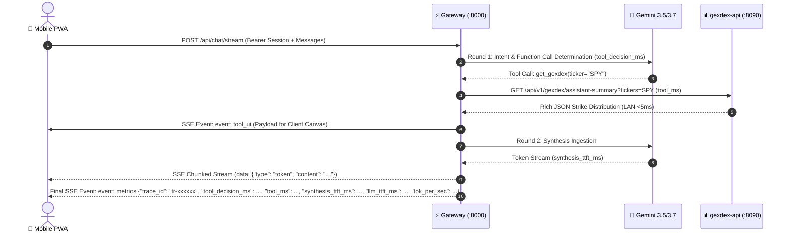

# ⚡ APIs, Gateways & MCP Protocols

## 1. Overview

The Quant System API tier consists of two FastAPI services:
1. **`gexdex-api` (Port 8090/8091):** Microservice for raw options chain calculation, dealer exposure analytics, and visual Matplotlib rendering.
2. **`quant-pwa` Gateway (Port 8000):** Backend-For-Frontend (BFF) providing low-latency SSE chat streaming, temporal market awareness, Google GenAI tool execution, and an MCP server.

---

## 2. `gexdex-api` Endpoint Reference

### 2.1 Health Check
* **`GET /health`**
* **Auth:** None (Public)
* **Response:**
  ```json
  {
    "status": "healthy",
    "timestamp": "2026-08-22T07:10:00Z",
    "service": "gexdex-api",
    "version": "1.0.0"
  }
  ```

---

### 2.2 Assistant Summary (JSON Quantitative Metrics)
* **`GET /api/v1/gexdex/assistant-summary`**
* **Auth:** `X-API-Key: <SECRET>` (or `api_key` query param)
* **Parameters:**
  - `ticker` (string, required): Ticker symbol (e.g. `SPY`, `NVDA`).
  - `include_chart` (boolean, optional, default: `true`): Include markdown chart URL reference.
* **Response (`200 OK`):**
  ```json
  {
    "ticker": "NVDA",
    "spot_price": 128.50,
    "call_wall": 135.0,
    "put_wall": 120.0,
    "zero_gex_level": 124.80,
    "net_gex": 45820000.0,
    "net_dex": -12450000.0,
    "call_gex": 68200000.0,
    "put_gex": 22380000.0,
    "call_put_ratio": 3.05,
    "gamma_regime": "LONG_GAMMA",
    "pin_risk_level": "MODERATE",
    "front_week_gex_pct": 0.642,
    "snapshot_time": "2026-08-21T20:00:00Z",
    "chart_url": "/api/v1/gexdex/chart.png?ticker=NVDA"
  }
  ```

---

### 2.3 Chart Image Binary Rendering
* **Parameters:**
  - `ticker` (string, required)
* **Response (`200 OK`):** Binary WebP/PNG image stream with `Content-Type: image/png` and `Cache-Control: public, max-age=300`.

---

### 2.4 DTE & Pin Risk Gamma Calculation Engine
* **Timezone Safety:** All option expiration timestamps are localized to UTC (`exp_date.tz_localize(timezone.utc) if exp_date.tzinfo is None else exp_date`) and subtracted from `datetime.now(timezone.utc)`.
* **Front-Week Gamma Concentration:**
  $$\text{Front-Week GEX Concentration} = \frac{\sum_{0 \le \text{DTE} \le 7} |\text{Net GEX}_{\text{exp}}|}{\text{Total Abs GEX}}$$
* **Pin Risk Classification:**
  - `HIGH`: Front-Week GEX Concentration $\ge 0.70$ and $|\text{Spot} - \text{Dominant Strike}| / \text{Spot} \le 0.015$.
  - `MODERATE`: $0.40 \le \text{Front-Week GEX Concentration} < 0.70$.
  - `LOW`: Front-Week GEX Concentration $< 0.40$.

---
  - `ticker` (string, required): Ticker symbol.
  - `format` (string, default: `webp`): Image format (`webp`, `png`).
* **Response:** Binary image stream (`image/webp` or `image/png`).
* **Concurrency Protection:** Protected by server-side `threading.Lock()` and in-memory `TTLCache`.

---

## 3. `quant-pwa` Gateway & Telemetry Streaming Engine



### 3.1 SSE Streaming Events Contract

| Event Name | Frame Structure | Purpose |
| :--- | :--- | :--- |
| **`tool_ui`** | `event: tool_ui\ndata: {"name": "get_gexdex", "payload": {...}}` | Transmits raw numerical strike tables directly to the frontend `<canvas>` renderer. |
| **`token`** | `data: {"type": "token", "content": "..."}` | Streamed text chunks generated by Gemini. |
| **`metrics`** | `event: metrics\ndata: {"trace_id": "...", "tier_used": "fast|strategic", "model_used": "...", "tool_decision_ms": ..., "tool_ms": ..., "synthesis_ttft_ms": ..., "llm_ttft_ms": ..., "token_count": ..., "tok_per_sec": ..., "server_total_ms": ...}` | Performance telemetry payload powering the client-side Diagnostics Waterfall HUD. |
| **`done`** | `data: {"type": "done"}` | Signals end of stream and triggers response badge mounting. |

---

### 3.2 Dynamic Split-Model Router (Router-Worker-Synthesizer Pattern)
* **Tier 1 (Fast Worker - `gemini-3.5-flash-lite`):** Handles high-frequency, single-ticker options lookups with `budget=0` (omits `thinking_config`) for **`< 1.0s` tool decision latency**.
* **Tier 2 (Strategic Synthesizer - `gemini-3.7-flash`):** Activated automatically when query matches macro keywords (`FOMC`, `rates`, `CPI`, `correlation`, `strategy`, `portfolio`) or multi-ticker cohorts. Configures a **512-token Chain-of-Thought thinking budget** for deep cross-asset synthesis.
* **Instant Failover Hierarchy:** 
  - Strategic Tier: `[3.7-flash -> 3.6-flash -> 3.5-flash-lite]`
  - Fast Tier: `[3.5-flash-lite -> 3.6-flash]`
  - Recovers from Google 429/503 spikes in `< 500ms` without blocking thread sleeps.

---

### 3.3 Top 20 Benchmark RAM Pre-Cache Warmer
* **Universe (20 Liquid Equities & Indices):** `SPY`, `QQQ`, `IWM`, `NVDA`, `AAPL`, `TSLA`, `META`, `AMZN`, `GOOGL`, `MSFT`, `AMD`, `PLTR`, `TSM`, `SMCI`, `COIN`, `CRWD`, `NFLX`, `SPX`, `NDX`, `RUT`.
* **Schedule:** Background asyncio loop runs every 180 seconds during US market trading hours (**Mon–Fri 08:30–16:15 ET**).
* **Speed:** Guarantees **`0.0ms` upstream tool latency** (`[CACHE: HIT]`) for >95% of daily user volume.

---

### 3.4 In-Memory Ring Buffer Remote Logging (`GET /api/diagnostics/logs`)
* **Endpoint:** `GET /api/diagnostics/logs?limit=100`
* **Auth:** Bearer Session Token (`verify_app_passcode`).
* **Implementation:** `_RingBufferHandler` captures the last 200 formatted log records in memory, allowing live debugging of Docker containers on DSM directly over HTTP without requiring SSH root permissions.

---

## 4. Model Context Protocol (MCP) Server Specifications

The Gateway exposes standard Model Context Protocol (MCP) transports for autonomous agents:

* **SSE Transport Endpoint:** `GET /mcp/sse`
* **Message Ingestion Endpoint:** `POST /mcp/messages?session_id=<UUID>`

### Implemented MCP Tools:
1. **`get_gexdex(ticker: str)`**: Retrieves real-time Call/Put Walls, Net Gamma, Net Delta, Gamma Flip level, and institutional dealer regime. Single-flight comma-separated batching (`META,AAPL,...`) supported.
2. **`get_strike_distribution(ticker: str, min_strike: float, max_strike: float)`**: Returns array of discrete strike-by-strike GEX and DEX bars for custom client-side visualization.
3. **`get_market_status()`**: Returns current Eastern Time, market session state (`REGULAR_HOURS`, `PRE_MARKET`, `AFTER_HOURS`, `WEEKEND_CLOSED`), and time to next open/close.
