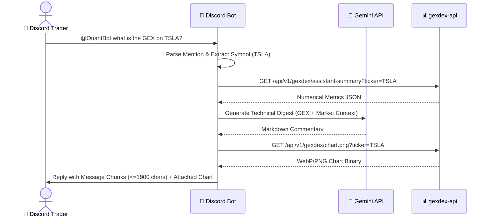

# 📱 Frontend & Client Applications Architecture

## 1. Quant AI Mobile PWA (`quant-pwa`)

### 1.1 Architecture & Design Principles
The PWA is designed specifically for **mobile traders on 5G/LTE and Home Wi-Fi**. It emphasizes zero framework bloat (<100KB bundle), instant launch times, and an OLED True Dark Theme (`#0b0e14`).

```text
quant-pwa/
├── frontend/
│   ├── index.html                   # Mobile shell (OLED dark theme, safe-area insets)
│   ├── styles.css                   # Minimalist CSS3 design system
│   ├── manifest.json                # PWA standalone manifest
│   ├── sw.js                        # Service Worker (Network-First HTML/JS, Cache-First Icons)
│   └── src/
│       ├── app.js                   # Main application bootstrap & SSE consumer
│       ├── state.js                 # Local storage (History sliding window, Passcode, Model)
│       ├── tabs/
│       │   ├── tab_manager.js       # Pluggable modular tab router
│       │   └── chat_view.js         # Streaming chat controller
│       └── components/
│           ├── diagnostics_modal.js # 5-stage latency waterfall drawer with Trace ID correlation
│           ├── settings_modal.js    # Settings configuration & diagnostics toggle switch
│           ├── quant_chart.js       # High-performance HTML5 Canvas options bar renderer
│           ├── lightbox.js          # Pinch-to-zoom full-screen chart modal
│           ├── message_renderer.js  # Markdown, LaTeX, and latency badge pill renderer
│           └── prompt_input.js      # Auto-expanding mobile prompt bar with quick chips
```

---

### 1.2 HTML5 Canvas Options Chart Engine (`quant_chart.js`)
* **Zero Dependency Canvas Engine:** Renders bi-directional horizontal bar charts (Call GEX in Emerald `#10b981`, Put GEX in Rose `#ef4444`) with zero external charting library bloat.
* **High-DPI Scaling:** Automatically adjusts canvas resolution based on `window.devicePixelRatio` for razor-sharp rendering on Retina/OLED mobile displays.
* **Interactive Geometry:** Touch and cursor crosshair inspection displays exact strike prices, call/put open interest, and net gamma values.
* **Level Lines:** Renders dashed horizontal reference lines for Spot Price (Yellow `#f59e0b`), Call Wall (Green), Put Wall (Red), and Zero Gamma Flip (Cyan `#06b6d4`).

---

### 1.3 State Management & Memory Sliding Window (`state.js`)
* **Local Storage Persistence:** Chat history, selected Gemini model (`gemini-3.7-flash`, `gemini-3.5-flash`), Bearer Session Token, and Performance Diagnostics toggle are persisted across sessions.
* **Sliding Window Context:** Retains the last 10–12 messages to feed into Gemini prompt history, pruning older interactions to maintain low token latency and prevent `localStorage` quota overflow.

---

### 1.4 Modal Lightbox & Touch Gestures (`lightbox.js`)
* **Pinch-to-Zoom & Pan Engine:** Allows traders to zoom in up to $4\times$ and pan high-resolution option charts on touch screens.
* **Double-Tap Quick Toggle:** Double-tapping toggles between $1\times$ and $2.5\times$ zoom levels.
* **Backdrop Dismissal:** Tapping anywhere outside the image or on the `✕` close button resets transforms and dismisses the overlay.
* **DOM Synchronization:** Elements strictly bind to `lightboxOverlay` and `lightboxImg` in `index.html`.

---

### 1.5 Institutional Bloomberg-Grade Diagnostics HUD (`diagnostics_modal.js`)
* **Visual Standard (Zero Emojis):** 100% purged all consumer emojis in favor of high-density monospace tabular typography (`font-variant-numeric: tabular-nums`, `JetBrains Mono`), sleek status dots (`●`), and institutional tier badges (`FAST · 3.5-LITE`, `STRATEGIC · 3.7-FLASH`, `[CACHE: HIT]`).
* **Live Response Latency Pill:** Embeds a high-density institutional badge in assistant message footers:
  `<span class="inst-tag inst-tag-fast"><span class="status-dot dot-fast"></span>FAST · 3.5-LITE</span> <span class="inst-stats">240ms · 78.4 tok/s</span> <span class="inst-cache">[CACHE: HIT]</span>`
* **5-Bar Monospace Latency Waterfall:**
  1. `01  NET     Network & SSE Handshake` (true RTT: ~20–35ms)
  2. `02  INTENT  Gemini Tool Selection (R1)` (ms)
  3. `03  DATA    Upstream Microservice (GEX/DEX)` (ms)
  4. `04  SYNTH   Gemini Synthesis TTFT (R2)` (ms)
  5. `05  RENDER  Client Canvas Paint` (ms)
* **Metadata Cards:** Displays Execution Tier, Cache Status (`HIT · 0.0ms` vs `MISS · COLD FETCH`), and Upstream Retries with live glowing status dots.
* **Settings Toggle:** Toggleable via `Show Performance Diagnostics` switch in the Settings modal.

---

## 2. Discord Quant Bot (`discord-quant-bot`)

### 2.1 Architecture
The bot is built with Python and `discord.py`, listening for mentions on dedicated trading channels and returning formatted institutional options summaries.



### 2.2 Reliability & Security Features:
1. **Zero-Trust Channel Allowlist:** Only responds in approved Discord server channels (`ALLOWED_CHANNELS`).
2. **Message Chunking:** Splits long analyses into $\le 1900$-character batches to prevent Discord HTTP 400 crashes.
3. **Safe Error Masking:** Catches exceptions and outputs user-friendly notices without leaking internal server IPs or database connection strings.
