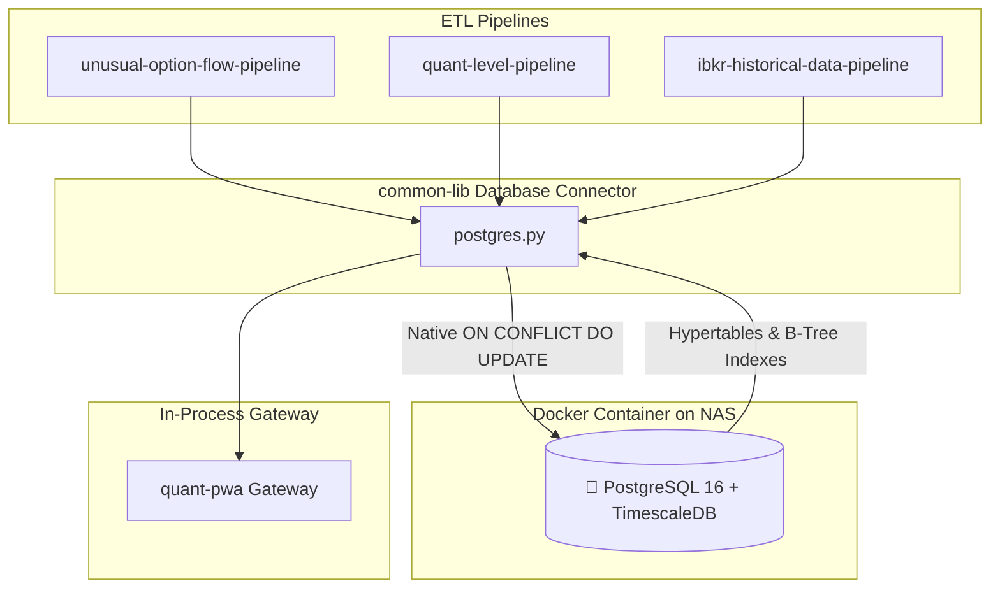

# 🐘 RFC DB-01: Strategic Migration to PostgreSQL + TimescaleDB

> **Document Version:** 1.0.0 (Strategic Architecture RFC)  
> **Target Standard:** L8 Principal Systems Architecture  
> **Status:** Approved for Implementation  
> **Component Scope:** `common_config`, `common-lib`, `quant-pwa`, `unusual-option-flow-pipeline`, `quant-level-pipeline`

---

## 1. Problem Statement & Motivation

The Quant System currently relies on an Oracle Database running in a Docker container on the Synology NAS.
* **Bottlenecks:**
  - High Memory Footprint: Oracle Free / XE consumes 4GB–8GB RAM, creating memory pressure on the host.
  - Disk I/O Overhead: Synchronous Redo log commits on Copy-on-Write (Btrfs) storage cause 500ms+ write latency spikes.
  - Complex Temporary Table Upserts: Requiring dynamic UUID staging tables (`TMP_...`) and complex `MERGE INTO` SQL statements.

---

## 2. Target PostgreSQL + TimescaleDB Architecture



---

## 3. Detailed Component Plan

### A. Database Container (`docker-compose.yml` in `quant-pwa` & NAS root)
* Image: `timescale/timescaledb:latest-pg16`
* Port: `5432:5432`
* Data Directory: `/var/lib/postgresql/data` mounted to persistent host volume.
* Default DB: `quant_db`
* User: `quant_admin`

### B. Connector Module in `common-lib` (`common_lib/connectors/postgres.py`)
* Connection Pool: SQLAlchemy `create_engine("postgresql+psycopg://...")` or `asyncpg`.
* Generic Upsert Function:
  ```python
  def write_to_postgres_upsert(config: MainConfig, df: pd.DataFrame, table_name: str, pks: List[str]) -> None:
      """
      Executes high-speed batched upsert using PostgreSQL's native ON CONFLICT clause.
      """
  ```
* Parameterized Queries:
  - `get_unusual_flow(config, symbols, lookback_days, min_premium)`
  - `get_quant_levels(config, ticker, as_of_date)`

### C. Automated Data Migration Script (`scripts/migrate_oracle_to_postgres.py`)
* Reads all existing rows from Oracle `QUANT_LVL_DATA_TE` and `UNUSUAL_OPTION_FLOW_TE`.
* Writes in batches of 5,000 rows to PostgreSQL with primary key integrity checks.

### D. Gateway & Pipeline Configuration
* Update `MainConfig` in `common-lib` to support `DB_TYPE=postgres` (with seamless backwards compatibility if `DB_TYPE=oracle`).
* Update `requirements.txt` across repositories to include `psycopg[binary]>=3.1.0`.

---

## 4. Verification & Testing Plan
1. **Local Pytest Tests:** 100% pass across `common-lib` and `quant-pwa` unit tests using mocked and live Postgres engines.
2. **Local Docker Stack:** Spin up Postgres container + Gateway in local Docker, execute live options and flow chat queries.
3. **Staging NAS (:8096):** Deploy to staging on `develop2` with Postgres container running on DSM.
4. **Production NAS (:8095):** Promote via PR to `master`.
