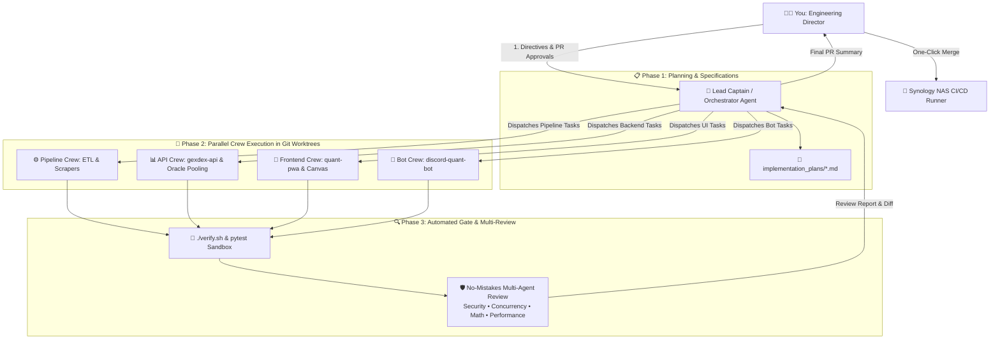

# 🚀 Applying the Multi-Agent "Captain-and-Crew" Workflow to Quant System

This blueprint translates the **L8 Principal Engineering Workflow** into an actionable, tailored multi-agent operating system for your **Quant System** (`C:\Coding\VSCode\Quant System`).

---

## 1. System Architecture: The Quant System Fleet

Instead of managing 10 repositories manually in a single chat, you operate as the **Engineering Director**, commanding a **Captain Agent** that delegates work across specialized **Crew Agents** operating concurrently in isolated Git worktrees.



---

## 2. Step-by-Step Implementation Guide

### Step 1: Establish Project Memory & Rules (`AGENTS.md`)
Create a single source of truth at `C:\Coding\VSCode\Quant System\AGENTS.md` that all agents automatically inherit.

```markdown
# Quant System Global Agent Guidelines

## 1. Golden Architectural Rules
- **Oracle Persistence**: ALWAYS append a UUID suffix to temporary tables (`TMP_..._{uuid}`) in `oracle.py` to prevent race conditions during concurrent upserts.
- **Connection Pools**: Reuse SQLAlchemy pooled engines; NEVER call `engine.dispose()` inside individual query helpers.
- **IBKR Connector**: ALWAYS use randomized `clientId` and wrap extraction in `try...finally: ib.disconnect()`.
- **API Streaming**: Gateway SSE routes MUST use native `chat.send_message_stream()` for sub-300ms mobile TTFT.
- **Secret Hygiene**: NEVER hardcode passwords, API keys, or IP addresses in source files. Read exclusively from `MainConfig` or `.env`.

## 2. Verification Protocol
- Every modified module MUST pass its `./verify.sh` or `pytest` before presenting diffs.
- Tests MUST run against isolated test tables (e.g. `QUANT_LVL_DATA_TE_TEST`), NEVER against production tables.
```

---

### Step 2: Set Up Parallel Git Worktrees
To allow multiple agents to work on different repositories simultaneously without merge conflicts or workspace locks:

```bash
# Create a dedicated worktrees directory inside your workspace root
mkdir -p "C:\Coding\VSCode\Quant System\worktrees"

# Create parallel worktree branches for active tasks
git -C "C:\Coding\VSCode\Quant System\gexdex-api" worktree add "../worktrees/gexdex-api-perf" -b fix/oracle-pooling
git -C "C:\Coding\VSCode\Quant System\quant-level-pipeline" worktree add "../worktrees/quant-level-cutoff" -b fix/cutoff-regex
git -C "C:\Coding\VSCode\Quant System\mm-dex-gex-pipeline" worktree add "../worktrees/mm-dex-gex-init" -b feat/complete-etl
git -C "C:\Coding\VSCode\Quant System\quant-pwa" worktree add "../worktrees/quant-pwa-lightbox" -b fix/lightbox-streaming
```

Now 4 independent agent sessions can run in parallel without touching each other's files.

---

### Step 3: Define Specialized Subagents

You can spin up specialized subagents in Antigravity or trigger them via prompt:

| Agent Role | Scope & Specialization | Typical Tasks |
| :--- | :--- | :--- |
| **`captain`** | Orchestrator & Multi-Repo Coordinator | Reads repo status, generates implementation plans, verifies dependency order (`common-lib` &rarr; `gexdex-api` &rarr; `quant-pwa`). |
| **`pipeline-crew`** | Data Engineering & Schedulers | Fixes `quant-level-pipeline` cutoff/regex bugs; implements `mm-dex-gex-pipeline` and `unusual-option-flow-pipeline`. |
| **`backend-crew`** | High-Performance Python & DB | Replaces static Oracle temp tables with UUIDs; implements `@lru_cache` SQLAlchemy engine pool; patches DTE operator precedence bug. |
| **`frontend-crew`** | Mobile PWA & Canvas Visualizations | Fixes Lightbox DOM ID mismatch; implements native token streaming; refines discrete strike level line interpolation. |
| **`reviewer-crew`** | "No-Mistakes" Multi-Review Gate | Audits diffs for security vulnerabilities, concurrency collisions, mathematical precision, and test isolation. |

---

### Step 4: The Daily Dev Cycle (Commanding the Fleet)

Here is how a real daily development session looks in practice:

#### 1. Plan Phase (Captain Alignment)
You prompt the Captain:
> *"Captain: We need to resolve Phase 1 of our review plan (fix Oracle temp table collisions, fix quant-level cutoff data loss, and fix PWA Lightbox ID mismatch). Create an implementation plan and assign worktree tasks."*

The Captain drafts the plan in `implementation_plans/phase1_hotfixes.md` with explicit file diff targets.

#### 2. Execution Phase (Parallel Crew Dispatch)
The Captain invokes parallel subagents:
- **Subagent 1 (`backend-crew`)** modifies `common-lib/common_lib/connectors/oracle.py` (UUID temp tables & engine pooling).
- **Subagent 2 (`pipeline-crew`)** modifies `quant-level-pipeline/src/extract.py` and `src/transform.py` (cutoff `>` fix & `\d{2,6}` regex).
- **Subagent 3 (`frontend-crew`)** modifies `quant-pwa/frontend/src/components/lightbox.js` and `gateway/app/core/agent.py` (Lightbox DOM IDs & real token streaming).

#### 3. Verification & Test Gate
Each subagent runs `./verify.sh` or `pytest` within its own worktree and reports test results back to the Captain.

#### 4. Multi-Agent Review Gate ("No-Mistakes")
Before merging, the Captain spawns a fresh **Reviewer Subagent** to audit the git diff:
> *"Audit all modified files across the 3 worktrees against our Security, Concurrency, and Math rules. Verify that no tests touch production DB tables."*

#### 5. Director Sign-Off & Synology CI/CD Merge
The Captain outputs a clean PR summary:
- ✅ **Summary of changes** across all 3 modules
- ✅ **Test results** (All unit tests passing)
- ✅ **Review verdict** (No blockers found)
- You review the summary, approve the PR, and the changes deploy automatically to your Synology NAS runner.

---

## 3. Recommended Project Structure

```text
C:\Coding\VSCode\Quant System\
├── AGENTS.md                          # 🧠 Master Project Memory & Rules
├── implementation_plans/              # 📋 Plans, RFCs, and Review Reports
│   ├── CODE_REVIEW_EXECUTIVE_SUMMARY.md
│   ├── CODE_REVIEW_BACKEND_AND_API.md
│   ├── CODE_REVIEW_PIPELINES.md
│   ├── CODE_REVIEW_BOT_AND_FRONTEND.md
│   ├── L8_PRINCIPAL_AGENTIC_WORKFLOW.md
│   └── QUANT_SYSTEM_MULTIAGENT_WORKFLOW.md
├── worktrees/                         # 🌲 Isolated Git Worktrees for concurrent agents
├── common-lib/                        # Core shared library
├── common_config/                     # Central YAML db catalogs & configs
├── gexdex-api/                        # Options analytics backend
├── quant-pwa/                         # Mobile AI PWA & Gateway
├── quant-level-pipeline/              # Scraper & quant levels ETL
├── mm-dex-gex-pipeline/               # Market Maker GEX/DEX ETL
├── unusual-option-flow-pipeline/      # Flow scanner ETL
└── discord-quant-bot/                 # Discord alerts bot
```

---

## 4. Next Action

To test-drive this workflow right now, we can launch our first **Captain-and-Crew cycle** to implement the **Phase 1 Critical Hotfixes** (Oracle UUID tables, Quant-level cutoff fix, and PWA Lightbox ID fix).
