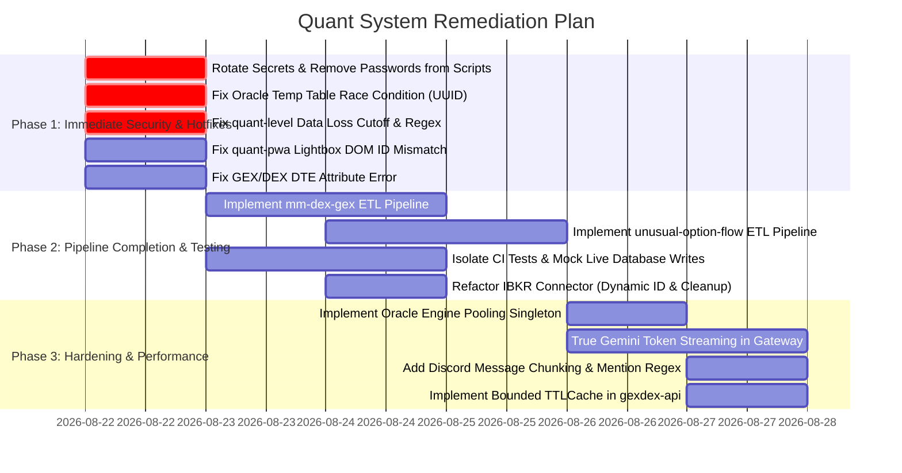

# 🛡️ Quant System: Multi-Repository Code Review & System Audit

**Audit Date:** August 2026  
**Target Root:** `C:\Coding\VSCode\Quant System`  
**Scope:** 10 Repositories & Modules  
- **Core & Infrastructure:** `common-lib`, `common_config`, `etl-pipeline-template`
- **APIs & Gateways:** `gexdex-api`, `quant-pwa` (FastAPI Gateway)
- **Data & Ingestion Pipelines:** `quant-level-pipeline`, `ibkr-historical-data-pipeline`, `mm-dex-gex-pipeline`, `unusual-option-flow-pipeline`
- **Clients & Applications:** `discord-quant-bot`, `quant-pwa` (HTML5/PWA Frontend)

---

## 1. Executive Summary & Health Radar

The **Quant System** is a sophisticated, institutional-grade quantitative trading platform featuring options market structure analysis (GEX/DEX), historical tick data ingestion, quant price levels, unusual options flow, AI-powered Discord notifications, and a mobile-first Quant AI PWA with Gemini and MCP integration.

Across the codebase, there is strong modular architecture, clear separation of concerns (ETL extract/transform/load patterns, BFF gateway, Docker deployments on Synology NAS), and modern API usage. However, our multi-agent audit revealed **critical security vulnerabilities, database concurrency collisions, silent data loss bugs, and incomplete skeleton modules** that must be resolved prior to full production deployment.

```
                  ┌─────────────────────────────────────┐
                  │       SYSTEM HEALTH RADAR           │
                  ├─────────────────────────────────────┤
                  │ Architecture & Modularity:   9.0/10 │
                  │ Quantitative & Financial:    8.5/10 │
                  │ Frontend & PWA UI:           8.5/10 │
                  │ Reliability & Error Handling: 6.0/10│
                  │ Pipeline Completeness:       5.5/10 │
                  │ Test Isolation & CI/CD:      5.0/10 │
                  │ Security & Secrets Hygiene:  3.5/10 │
                  └─────────────────────────────────────┘
```

---

## 2. Master Findings Matrix

| Severity | ID | Module / Component | Impacted File(s) | Category | Core Finding Summary |
| :---: | :---: | :--- | :--- | :--- | :--- |
| 🔴 **CRIT** | **SEC-01** | `common-lib` | `scripts/deploy_all.py:24` | Security | Plaintext SSH password and `sudo` root escalation password in deployment script. |
| 🔴 **CRIT** | **SEC-02** | `common_config` | `common_config/.env:1-12` | Security | Unencrypted production Oracle passwords, portal secrets, and active session cookies in repository. |
| 🔴 **CRIT** | **COR-01** | `common-lib` | `connectors/oracle.py:248-295` | Concurrency | Static temp table names (`TEMP_...`) in `MERGE` statements cause race conditions, crashes, or data corruption during concurrent pipeline runs. |
| 🔴 **CRIT** | **PIP-01** | `quant-level-pipeline` | `src/extract.py:144` | Data Loss | Incremental cutoff logic adds `+ timedelta(days=1)`, silently dropping all posts created within 24 hours of cutoff. |
| 🔴 **CRIT** | **PIP-02** | `quant-level-pipeline` | `tests/test_running_scripts.py:19,39` | Data Safety | Integration test suite executes `load.run('overwrite')` and `DELETE` queries directly against production Oracle tables. |
| 🔴 **CRIT** | **PIP-03** | `mm-dex-gex-pipeline` | `src/extract.py, transform.py, load.py` | Completeness | Pipeline is incomplete (0-byte stubs; `extract.py` contains scratch GenAI code; missing transform/load). |
| 🔴 **CRIT** | **PIP-04** | `unusual-option-flow-pipeline` | `src/extract.py, transform.py, load.py` | Completeness | Pipeline is an empty skeleton (0-byte stubs; missing option flow ETL logic). |
| 🔴 **CRIT** | **PIP-05** | `common-lib` (optionflow) | `tradingedge/optionflow.py:55` | Auth / Logic | Session cookie extracted from outbound request headers instead of server response cookies (`session.cookies`), breaking authentication. |
| 🔴 **CRIT** | **PIP-06** | `common-lib` (ibkr) | `connectors/ibkr.py:26,62,95` | Reliability | Hardcoded IBKR `clientId=1` causes connection collisions; missing `finally: ib.disconnect()` permanently leaks socket connections on errors. |
| 🟠 **HIGH** | **SEC-03** | `gexdex-api` | `app/config.py:21`, `docker-compose.yml:10` | Security | Fallback API key `"YOUR_SECRET_API_KEY_HERE"` allows unauthenticated access if env var is unset. |
| 🟠 **HIGH** | **SEC-04** | `gexdex-api` | `app/main.py:12-18` | Security | Insecure CORS configuration (`allow_origins=["*"]` + `allow_credentials=True`) allows cross-origin credential reflection. |
| 🟠 **HIGH** | **SEC-05** | `quant-pwa` | `gateway/app/main.py:218`, `mcp/server.py:332` | Security / Auth | `/api/v1/gexdex/chart.png` and `/mcp/*` endpoints lack authentication dependency verification. |
| 🟠 **HIGH** | **BUG-01** | `quant-pwa` | `frontend/src/components/lightbox.js:3-4` | UI / Bug | DOM ID mismatch (`lightboxModal` vs `lightboxOverlay`, `lightboxImage` vs `lightboxImg`) breaks Lightbox & Fullscreen chart view. |
| 🟠 **HIGH** | **COR-02** | `gexdex-api` | `app/services/gexdex_service.py:171-177` | Quantitative | Precedence bug `(exp_date.tz_localize('UTC')).days` throws `AttributeError`, silently swallowed by `except Exception: pass`, breaking DTE and Pin Risk calculations. |
| 🟠 **HIGH** | **PIP-07** | `quant-level-pipeline` | `src/transform.py:43` | Correctness | Price level regex restricted to 4 digits (`\d{4}`), failing on 3-digit tickers (SPY, QQQ) and 5-digit indices (NDX, DJIA). |
| 🟠 **HIGH** | **PIP-08** | `quant-level-pipeline` | `src/extract.py:289` | Data Loss | Attachment download failure returns `None`, overwriting and erasing previously parsed HTML body text. |
| 🟠 **HIGH** | **PERF-01** | `common-lib` | `connectors/oracle.py:14-19,39,59,77` | Performance | Complete recreation and destruction (`dispose()`) of SQLAlchemy engine on every single query, killing connection pooling. |
| 🟠 **HIGH** | **TST-01** | `common-lib` | `tests/conftest.py:21-43`, `test_ntfy.py:28` | Test Isolation | Unit tests authenticate against live external websites and send real priority-5 push notifications to mobile devices during test runs. |
| 🟡 **MED** | **BOT-01** | `discord-quant-bot` | `src/main.py:62,68` | Reliability | Discord 2000-character overflow causes unhandled exceptions; raw error tracebacks leaked to chat. |
| 🟡 **MED** | **BOT-02** | `discord-quant-bot` | `src/api.py:23,28` | Concurrency | Missing HTTP timeouts in `requests.get()`; static temporary filename causes collision on concurrent chart generation. |
| 🟡 **MED** | **UI-01** | `quant-pwa` | `frontend/src/components/quant_chart.js:520` | Charting | Continuous level line interpolation drifts from discrete strike rows on non-linear options chains. |
| 🟡 **MED** | **PERF-02** | `quant-pwa` | `gateway/app/core/agent.py:113,165` | UX / Latency | Simulated token streaming waits for complete Gemini response before emitting SSE chunks, increasing Time-To-First-Token. |
| 🟡 **MED** | **PERF-03** | `gexdex-api` | `app/services/gexdex_service.py:302-305` | Memory | Unbounded in-memory dictionaries `_RAW_CACHE` and `_CHART_CACHE` create memory leak risk on 24/7 deployments. |
| 🟡 **MED** | **CI-01** | `Pipelines & Template` | `.github/workflows/deploy.yml` | CI/CD | Broken copy steps (`cp -r common_lib`), missing `pyproject.toml`, and variable name mismatch (`ORACLE_HOST_IP` vs `SYNOLOGY_MAIN_IP`). |
| 🟢 **LOW** | **A11Y-01** | `quant-pwa` | `frontend/index.html`, `components/*.js` | Accessibility | Missing ARIA labels on model selector, tab navigation, modals, and canvas chart summaries. |

---

## 3. Top Architectural & Cross-Cutting Themes

### 1. Database Concurrency & Engine Lifecycle
- **The Issue:** `common-lib/common_lib/connectors/oracle.py` handles all persistence via Oracle `MERGE INTO`. However, it relies on static staging table names (`TEMP_` + table_name[:20]) and creates/disposes an engine on every call.
- **The Solution:** 
  - Append a unique UUID suffix (`f"TMP_{table_name[:12]}_{uuid.uuid4().hex[:8]}".upper()`) to prevent concurrent job collisions.
  - Implement a cached engine pool singleton (`@lru_cache`) with `pool_size=5`, `max_overflow=10`, and `pool_pre_ping=True`.

### 2. Live Test Isolation & CI/CD Hygiene
- **The Issue:** Several test suites (`quant-level-pipeline/tests/test_running_scripts.py`, `common-lib/tests/test_oracle.py`, `test_ntfy.py`) execute destructive write operations, truncate production tables, or send push notifications during standard test execution.
- **The Solution:**
  - Mock all external connectors and database sessions in unit tests using `unittest.mock` / `pytest-mock`.
  - Tag end-to-end database tests with `@pytest.mark.integration` and execute them against dedicated sandbox tables (e.g. `QUANT_LVL_DATA_TE_TEST`).

### 3. Pipeline Standardization & Completeness
- **The Issue:** `quant-level-pipeline` is nearly complete but suffering from cutoff and regex bugs. `mm-dex-gex-pipeline` and `unusual-option-flow-pipeline` are early stubs with broken deployment scripts.
- **The Solution:**
  - Fix the 1-day offset in `_prune_old_posts` (`item_date > cutoff_date`).
  - Standardize `extract.py`, `transform.py`, `load.py` across all pipelines using `common-lib`.
  - Harmonize `.github/workflows/deploy.yml` with the single standard defined in `common_config/CI_CD_DESIGN_STEERING_DOC.md`.

---

## 4. Multi-Phase Remediation Roadmap



---

## 5. Detailed Review Documents

Detailed findings, code diffs, line-by-line analyses, and step-by-step fix guides are documented in the companion review files:

1. **[Backend Core & API Review](file:///C:/Coding/VSCode/Quant%20System/implementation_plans/CODE_REVIEW_BACKEND_AND_API.md)** (`common-lib`, `common_config`, `etl-pipeline-template`, `gexdex-api`)
2. **[Data & Ingestion Pipelines Review](file:///C:/Coding/VSCode/Quant%20System/implementation_plans/CODE_REVIEW_PIPELINES.md)** (`quant-level-pipeline`, `ibkr-historical-data-pipeline`, `mm-dex-gex-pipeline`, `unusual-option-flow-pipeline`)
3. **[Bot & Frontend Applications Review](file:///C:/Coding/VSCode/Quant%20System/implementation_plans/CODE_REVIEW_BOT_AND_FRONTEND.md)** (`discord-quant-bot`, `quant-pwa`)
