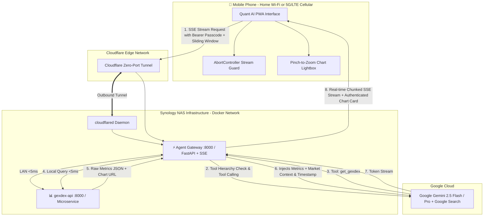

# Implementation Plan: Quant AI Mobile Chat PWA (FAANG Architecture Blueprint)

A high-performance, mobile-first **Quant AI Chat Application** powered by a server-side **Agent Gateway** hosted on your Synology NAS. It delivers **sub-300ms Time-to-First-Token (TTFT)** streaming to your phone (over **Home Wi-Fi** or **5G/LTE Cellular** via Cloudflare Tunnel), secures access via an **App Passcode**, displays live market timestamps/freshness badges, feeds direct `gexdex-api` metrics into Gemini, enforces proprietary tool hierarchy, guards against race conditions with `AbortController`, cleans up disconnected streams, and features a **modular tab system** and **pluggable skill registry**.

---

## 🎯 Architectural Decisions & Alignment

| Dimension | Selected Architecture | Implementation Details |
| :--- | :--- | :--- |
| **Orchestration** | **NAS Agent Gateway (BFF)** | Python/FastAPI gateway runs directly on Synology Docker network (<5ms internal hop to `gexdex-api`). Eliminates 4-hop mobile cellular latency. |
| **Authentication** | **App Passcode (Bearer Token)** | Configured in the NAS `.env` file and entered once in the PWA Settings drawer. Persistent in local storage. |
| **Data Flow** | **Direct `gexdex-api` JSON Metrics** | Gateway queries `/api/v1/gexdex/assistant-summary` and passes full metrics (`spot_price`, `net_gex`, `net_dex`, `zero_gex_level`, `call_gex`, `put_gex`, `call_put_ratio`) directly to Gemini. |
| **Tool Priority Hierarchy** | **Proprietary Data First** | Prompt enforces `get_gexdex` as the sole source of truth for Greeks/walls/levels; Google Search is reserved exclusively for macro news, earnings, and Fed catalysts. |
| **Temporal Context** | **Market Hours + Timestamp Badges** | Gateway calculates NY market open/close state (`REGULAR_HOURS`, `AFTER_HOURS`, `WEEKEND_CLOSED`) and Gemini displays a prominent **data freshness & snapshot timestamp badge** in its analysis. |
| **Chart Delivery** | **Method 1 (Token in Query Param) + Lightbox** | Charts are loaded via authenticated image URLs (`/api/v1/gexdex/chart.png?ticker=NVDA&api_key=...`). Tapping any chart opens the **Pinch-to-Zoom Lightbox**. |
| **Stream Lifecycle & Disconnects** | **`request.is_disconnected()` Cleanup** | Gateway monitors client drops to immediately abort upstream Gemini tasks and save token spend if mobile signal drops. |
| **Race Condition Guard** | **`AbortController` + Stop Button** | Submitting a new prompt aborts any active SSE reader; prompt bar provides a ⏹️ "Stop Generating" button while streaming. |
| **Memory & Storage** | **Sliding Window Memory in `localStorage`** | 10–15 message sliding window sent to Gemini; persistent chat history and settings stored in `localStorage`. |
| **Remote Access** | **Cloudflare Tunnel (Option A)** | Zero open router ports, universal edge SSL, and full CGNAT/5G compatibility. |
| **Mobile PWA Feel** | **Standalone iOS/Android PWA** | `env(safe-area-inset-top/bottom)` padding, virtual keyboard auto-scroll physics, and offline shell caching via Service Worker. |
| **Extensibility** | **Pluggable Tab Manager & Skill Registry** | Modular tab router (`tab_manager.js`) and pluggable skill registry (`registry.py`) to add future tabs (*Levels*, *Flow*) and tools without rewriting core code. |

---

## 🏗️ End-to-End System Flow



---

## 📂 Project Structure (`quant-pwa`)

Location: `c:\Coding\VSCode\Quant System\quant-pwa\`

```text
quant-pwa/
├── frontend/                        # Mobile-first PWA Client (<100KB footprint)
│   ├── index.html                   # Mobile shell (Header, Stream, Tab Bar, Prompt Bar, Settings Drawer)
│   ├── styles.css                   # Clean Slate Minimalist dark theme (#121824), mobile safe-area
│   ├── manifest.json                # PWA manifest (standalone OLED display)
│   ├── sw.js                        # Service worker for instant offline shell caching
│   └── src/
│       ├── app.js                   # Application bootstrap & SSE stream consumer with AbortController
│       ├── state.js                 # Local storage state (Passcode, Model choice, Chat history, Sliding window)
│       ├── tabs/
│       │   ├── tab_manager.js       # Pluggable Tab Router
│       │   └── chat_view.js         # Low-latency streaming chat component
│       └── components/
│           ├── message_renderer.js  # Markdown, LaTeX, Code & Chart Image renderer with Timestamp badge
│           ├── lightbox.js          # Pinch-to-zoom full-screen chart viewer
│           └── prompt_input.js      # Auto-expanding mobile prompt bar with quick chips & Stop button
│
├── gateway/                         # Python / FastAPI Agent Gateway (Runs on NAS)
│   ├── app/
│   │   ├── main.py                  # FastAPI app with SSE `/api/chat/stream`, Auth & Disconnect hooks
│   │   ├── config.py                # Environment settings & secrets loader
│   │   ├── core/
│   │   │   ├── agent.py             # Gemini 2.5 Flash/Pro streaming agent runner with Tool Hierarchy
│   │   │   ├── temporal.py          # Market hours & snapshot freshness engine
│   │   │   └── context.py           # Context sliding window buffer (10-15 msgs)
│   │   └── tools/
│   │       ├── registry.py          # Pluggable tool registry
│   │       ├── gexdex_tool.py       # GEX/DEX tool (queries gexdex-api /assistant-summary)
│   │       └── web_search.py        # Google Search Grounding integration
│   ├── requirements.txt             # fastapi, uvicorn, google-genai, httpx, pytz
│   └── Dockerfile                   # Lightweight Python 3.11-slim container
│
├── docker-compose.yml               # Unified Synology deployment (Gateway + Nginx Frontend + cloudflared)
└── .env.example                     # APP_PASSCODE, GEMINI_API_KEY, GEXDEX_API_URL, CLOUDFLARE_TUNNEL_TOKEN
```

---

## ⚡ Key Modules & Implementation Details

### 1. Gateway Authentication & Disconnect Middleware (`gateway/app/main.py`)
- Verifies `Authorization: Bearer <APP_PASSCODE>` header on all `/api/` requests.
- Listens to `request.is_disconnected()` to abort upstream Gemini calls if the phone connection drops.

### 2. Market-State & Freshness Engine (`gateway/app/core/temporal.py`)
- Calculates NY market open/close state (`REGULAR_HOURS`, `PRE_MARKET`, `AFTER_HOURS`, `WEEKEND_CLOSED`).
- Stamps current time and snapshot age directly into the system prompt and response payload.

### 3. Tool Hierarchy Engine (`gateway/app/core/agent.py`)
- Explicitly directs Gemini to use `get_gexdex` for all options/GEX/DEX/wall queries, using Google Search Grounding only when the prompt explicitly touches breaking news or macro events.

### 4. Direct GEX/DEX Tool (`gateway/app/tools/gexdex_tool.py`)
- Calls `http://gexdex-api:8000/api/v1/gexdex/assistant-summary?ticker=...`.
- Appends the query-param authentication token to the returned chart URL (`/api/v1/gexdex/chart.png?ticker=...&api_key=...`).

### 5. Frontend Streaming Consumer with AbortController (`frontend/src/`)
- Native `EventSource` / `fetch` SSE parser with `AbortController` cancellation.
- Auto-scrolls smoothly during token streaming.
- Tapping any options chart opens the `lightbox.js` component with pinch-to-zoom and pan support.

---

## 🧪 Verification Plan

### Automated Verification
1. **Gateway Auth & Disconnect Tests**: Verify requests with valid/invalid passcodes and stream cancellation.
2. **Gemini Streaming Tests**: Test mock tool execution and verify streaming SSE output format.
3. **PWA Manifest & Asset Check**: Validate offline service worker caching and Lighthouse PWA compliance.

### End-to-End User Verification
1. **Low-Latency Streaming**: Send a question on your phone and verify text begins streaming in **<300ms**.
2. **Tool Hierarchy Test**: Ask *"What is the GEX profile on TSLA?"* -> verify it queries `gexdex-api` rather than doing an unnecessary web search.
3. **Stop Generating & Race Guard**: Submit a question, tap "Stop Generating", and verify stream terminates immediately.
4. **Chart Lightbox**: Tap the chart image on mobile and verify full-screen pinch-to-zoom works smoothly.
5. **Dual Network Access**: Open the PWA on Home Wi-Fi and 5G Cellular data to confirm seamless connectivity.
